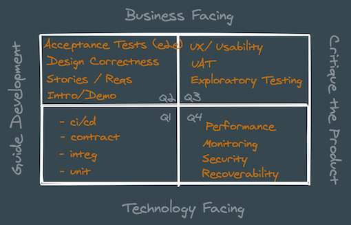

### Task 1

Imagine the following situation: you are joining a cross-functional team which builds a front-end application using REST APIs. You are a first QA engineer and need to establish a QA process in the team.
1. What would you do in your first few days of work? Where would you start?
2. Which process would you establish around testing new functionality?
3. Which techniques or best practices in terms of code architecture and test design would you use in your automated tests?

-----
##### Possible Approaches

Usually when I join a new team or project I try to define the current situation. At first there are two essential things, first one is to define goals and other requirements for this project, second one is to have a meeting with each member and stakeholder to recognize their expectations, attitudes, experience and other flavors. Later you can plan what would be best fit for the current project. 

Hi-level action plan usually looks likes as follow: 
- define the goals
- explore the project
  - functional requirements
  - non-functional requirements
  - architecture and integration components
  - infrastructure
  - team
  - current processes
- prepare a roadmap 
  - share with team and management
- common QA approaches
  - quality metrics
  - testing levels
  - functional requirements
  - processes
  - release management
  - ci/cd
  - infrastructure as a code
  - monitoring

More details on each point: ...

###### Define the goals

At first it's great to recognize what stakeholders expects from this project and what problem it solves. When this is clear to you it is easier to prioritise things and decisions, because you should always considering costs and benefits comparison. 

It's great to realize risks for this project, how they vary from minor to catastrophic and how likely they can occur. 
Depends on criticality you can better plan implementation and maintenance cost of qa processes decisions. 

Because in some rare cases the best approach would be just once manual test implemented solution and that it. For example in case when you have really tight deadlines, single-day project and not expected to extend it in a future (some landing page for specific conference or something like this)

So it's great to define the goals :)

###### Explore the project

Before to start to run in any direction it's essential to realize where you are and what you have. 

We need to understand what do have in next sections: 
- functional requirements
- non-functional requirements
- architecture and integration components
- infrastructure
- team
- current processes

Functional reqs are unique for every feature, the main thing (for now) with them is to define the current approaches how it collects and stores. Later we will decide if we need special tools for reqs or more lightweight tools would be fine. 

Non-functional reqs will help us to understand if we need more complex scenarios, tests or processes. For example do we need performance/load, fault-tolerant, security and other types of *-ility testing.

If a project already exists it is required to understand current architecture, it will help to define test levels and critical paths for testing. 

It's better to know what we have from infrastructure perspectives. Is it cloud solutions or our own servers. How do we configure stands — by hands or with provisioning tools. Do our engineers be ready to support and extend this. Do we have common tools for monitoring and deployments. And so on. 

It is essential to speak individually with each member of a team to better know his or her tech background, what tools he or she prefer, their opinion about tests, test coverage, do they have any struggles with the current process and so on. It will help to choose the best approach to implement new stuff or change some if it will require. 

And of course it is important to research current processes and make notes if there any downsides with them. 

###### Common QA approaches

Let's consider regular web-based application which is use REST APIs. 

At a hi-level I usually guided with Agile Testing Quadrants, which could be presented as follow:

The agile testing quadrants are a systematization of different types of testing. 

Tests on the left-hand side are those that guide development, the ones that are written before coding happens or concurrently as coding proceeds. The tests on the right-hand side are those that critique (evaluate) the product after coding is complete. Tests on the left help prevent defects. Tests on the right find defects in the code or perhaps identify missing features.

The top half of the quadrants focuses on tests that are readable by business stakeholders. These tests answer the question, “Are we building the right thing?” The bottom half includes tests that are written by and for technical team members. The business stakeholders probably care about the end results, but they would not try to read the tests. The top half is about external quality as defined by the business. The bottom half is about internal code or infrastructure correctness.

All quadrants serves to single goal — improve quality. But every activity has it's on cost as well as pros and cons. For example best coverage and confidence we will achieve with Acceptance Tests at System level (it goes through all integrated components and cover all user stories), but they have downsides — they are long running, fragile, doesn't indicate why something is not working, difficult to maintain (in a large scales) and so on. So to leverage this, it is useful to write test on different levels. For example unit and component tests could give you confidence that single component/module is behave correct, integ tests will give confidence that integration is ok, contract tests allow you decouple integrated components and so on. 

Usually when there is no any automation it's better to start from system/e2e tests, integrate them to ci/cd, to have a safety net. Later you can start refactor your code base for simplifying writing unit tests (for example using DI, or decoupling components via appropriate patterns or contracts). Also you could add metrics and setup alerting to be aware of any issues on production. 

So in short the maximum plan is to write auto-test in all levels (unit, integ, contract, e2e), automate ci/cd, test requirements before development is starting, define acceptance criterias for new features, have demos and kick offs for better understand what is required to develop, have usability and ux testing, automate performance and have monitoring and alerting. 
But depends on circumstances, resources, criticality, requirements and other things some stages could be added, changed or skipped.

